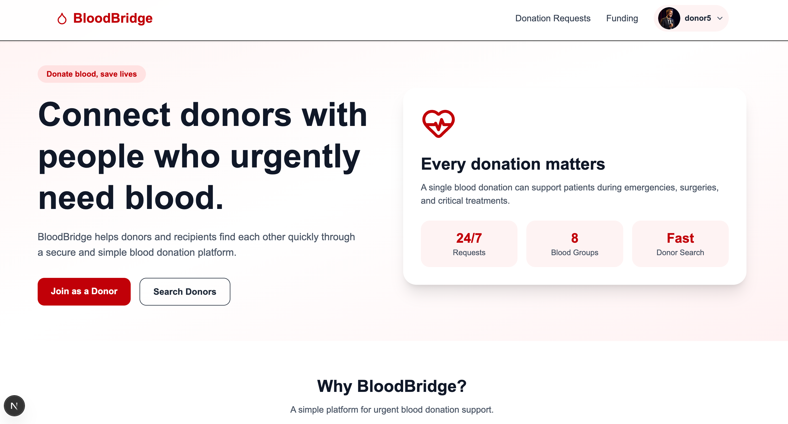
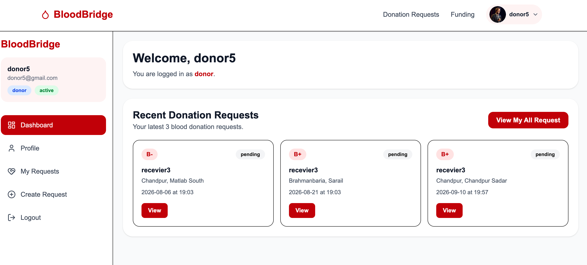
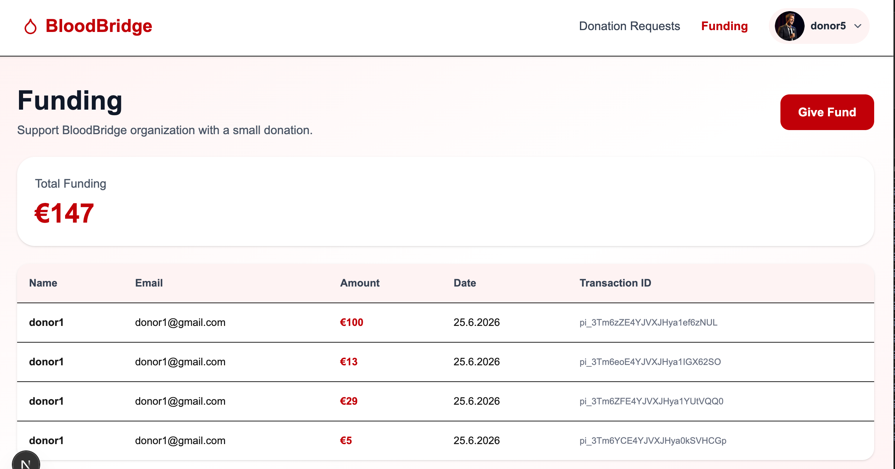

# 🩸 BloodBridge

BloodBridge is a full-stack MERN-based blood donation platform that connects blood donors with people in urgent need. The application provides a secure and user-friendly environment where donors, volunteers, and administrators can efficiently manage blood donation requests, donor information, and funding.

---

## 🌐 Live Website

🔗 Live Site: https://blood-bridge-client-puce.vercel.app/

---

## 📸 Project Preview







---

## 🚀 Features

- 🔐 Secure Email & Password Authentication
- 🛡️ JWT Protected Private APIs
- 👤 Role-Based Access Control (Admin, Donor, Volunteer)
- 🩸 Blood Donation Request Management
- 📄 Public Blood Donation Request Listing
- ❤️ Donate Blood via Request Details Page
- 👥 Donor Search by Blood Group, District & Upazila
- ✏️ Editable User Profile
- 📊 Dashboard for Different User Roles
- 👨‍💼 Admin User Management
- 🚫 User Block / Unblock System
- 🔄 Role Management (Donor, Volunteer, Admin)
- 💳 Stripe Payment Integration for Funding
- 📑 Pagination & Filtering
- 📱 Fully Responsive Design
- 🌙 Light Theme Optimized
- ☁️ Image Upload using ImageBB

---

## 👥 User Roles

### 🩸 Donor

- Register & Login
- Update Profile
- Create Blood Donation Requests
- Manage Own Donation Requests
- Donate Blood
- Search Donors
- View Funding
- Donate Funds

### 🤝 Volunteer

- View All Donation Requests
- Update Donation Request Status
- Dashboard Statistics

### 🌐 Admin

- Dashboard Statistics
- Manage All Users
- Block / Unblock Users
- Promote Users to Volunteer or Admin
- Manage All Blood Donation Requests
- View Funding Statistics

---

## 🛠 Tech Stack

### Frontend

- Next.js 16
- React 19
- Tailwind CSS
- React Hook Form
- Axios
- Better Auth
- React Hot Toast
- SweetAlert2
- Stripe React SDK
- Lucide React

### Backend

- Node.js
- Express.js
- MongoDB
- JWT
- Stripe API
- Cookie Parser
- CORS
- Dotenv

---

## 📦 NPM Packages Used

### Client

- next
- react
- react-dom
- tailwindcss
- axios
- better-auth
- react-hook-form
- react-hot-toast
- sweetalert2
- @stripe/react-stripe-js
- @stripe/stripe-js
- lucide-react

### Server

- express
- mongodb
- jsonwebtoken
- stripe
- cors
- cookie-parser
- dotenv

---

## 🔑 Main Functionalities

### Authentication

- Email Registration
- Email Login
- Secure JWT Authentication
- Protected Routes
- Persistent Login After Refresh

### Donor Features

- Create Blood Donation Requests
- Edit Requests
- Delete Requests
- Update Donation Status
- View Donation History

### Admin Features

- Manage Users
- Change User Roles
- Block & Unblock Users
- Manage Donation Requests
- Dashboard Statistics

### Volunteer Features

- View All Requests
- Update Request Status

### Funding

- Stripe Payment Gateway
- Funding History
- Total Funding Statistics

### Search

- Search Donors
- Filter by:
  - Blood Group
  - District
  - Upazila

---

## 📂 Folder Structure

```
bloodbridge-client
│
├── app
├── components
├── hooks
├── lib
├── public
│   └── images
├── styles
└── ...
```

```
bloodbridge-server
│
├── index.js
├── middleware
├── routes
├── package.json
└── ...
```

---

## 🔒 Environment Variables

### Client (.env.local)

```
NEXT_PUBLIC_API_URL=
NEXT_PUBLIC_IMAGEBB_KEY=
NEXT_PUBLIC_STRIPE_PUBLISHABLE_KEY=
```

### Server (.env)

```
PORT=
MONGODB_URI=
JWT_SECRET=
CLIENT_URL=
STRIPE_SECRET_KEY=
```

---

## 📌 Challenge Features Implemented

- ✅ JWT Authentication
- ✅ Role Based Dashboard
- ✅ Pagination
- ✅ Filtering
- ✅ Stripe Payment
- ✅ Responsive Design
- ✅ Protected Routes
- ✅ Search Donors
- ✅ Funding System

---

## 📖 Resources Used

- Bangladesh District & Upazila Dataset
- ImageBB API
- Stripe Payment API

---

## 🔗 Client Repository

https://github.com/nurhossain-webd/blood-bridge-client.git

---

## 🔗 Server Repository

https://github.com/nurhossain-webd/blood-bridge-server.git

---

## 👨‍💻 Admin Credentials

**Admin Email**

```
donor1@gmail.com
```

**Admin Password**

```
Donor1@gmail.com
```

---

## 🎯 Assignment Requirements Covered

- ✅ MERN Stack Application
- ✅ JWT Protected APIs
- ✅ Role-Based Authorization
- ✅ Dashboard
- ✅ CRUD Operations
- ✅ Stripe Payment
- ✅ Pagination
- ✅ Filtering
- ✅ Responsive UI
- ✅ Environment Variables
- ✅ Protected Routes After Refresh
- ✅ Image Upload
- ✅ Unique UI Design

---

## 📄 License

This project was developed for the Programming Hero Assignment **A10 - Blood Donation Platform**.
